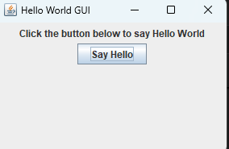
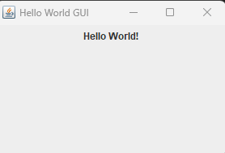

# nikitha-mbokotwana-08

#Project Description
This is a HelloWorldGUI, which is a simple Java Swing application that demonstrates the creation of a graphical user interface (GUI). The application features a window with a label and a button. When the button is clicked, the label updates to display "Hello World!" and the button disappears. It showcases basic GUI components such as JFrame, JLabel, and JButton, along with event handling using ActionListener.

#How to Run the Project
1. Prerequisites
To run this project, you will need:

Java Development Kit (JDK) version 8 or higher.
A Java IDE or terminal to compile and run Java programs (e.g., IntelliJ IDEA, Eclipse, or terminal with javac).
2. Compile and Run
a Save the Code
Save the provided code to a file named HelloWorldGUI.java.

b Compile the Code
In your terminal or command prompt, navigate to the folder where HelloWorldGUI.java is located and compile the code using the following command: javac HelloWorldGUI.java

After the program is compiled, run it using the following command: java HelloWorldGUI

#Dependencies or Prerequisites
Java SDK: This project requires Java 8 or higher to compile and run.

#Project in Action Screenshots

Initial State:
The application window will appear with a label saying:

After Button Click:
When the user clicks the "Say Hello" button the label's text will change to:

